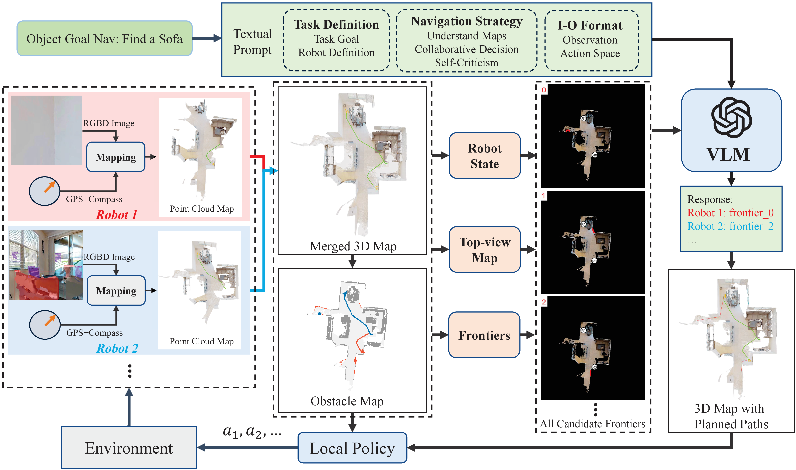
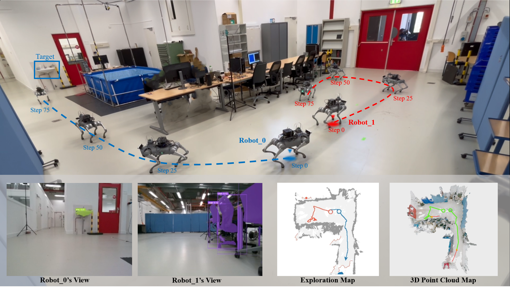

# Co-NavGPT2: Visual Semantic Navigation with ROS 2 and Nav2

[**Paper**](https://arxiv.org/abs/2310.07937v3) |
[**Project page**](https://sites.google.com/view/co-navgpt2) |
[**Video**](https://youtu.be/vnOJDUoQ7A8)

This repository contains the original Co-NavGPT2 Habitat and multi-robot
implementation plus a current ROS 2 integration package, `co_nav2_nav`. The
ROS 2 package connects a RealSense RGB-D camera and Livox/FAST_LIO localization
to SLAM Toolbox and Nav2, performs semantic target detection with YOLO-World
and MobileSAM, explores reachable map frontiers, and approaches a confirmed
target through validated Nav2 goals.

The source code, launch files, robot parameters, behavior trees, RViz
configuration, and tests are versioned for review. Datasets, downloaded model
weights, local environments, generated ROS build products, and secrets are
intentionally excluded by `.gitignore`.

## System overview

```text
RealSense RGB + aligned depth + CameraInfo
             │
             ├─ YOLO-World → MobileSAM → target pixels
             │                            │
             │                     depth back-projection
             │                            │ TF at image time
             │                            ▼
             │                     target point in map
             │
Livox → FAST_LIO → registered cloud → pointcloud_to_laserscan
                                             │
                                             ▼
                                      SLAM Toolbox → /map
                                             │
                       ┌─────────────────────┴─────────────────────┐
                       │                                           │
              no confirmed target                         confirmed target
                       │                                           │
             reachable frontier search                    standoff candidates
                       └─────────────────────┬─────────────────────┘
                                             ▼
                               ComputePathToPose validation
                                             ▼
                                  NavigateToPose / Spin
                                             ▼
                                      Nav2 → /cmd_vel
```

The current ROS 2 path does not ask a VLM to choose motion commands. It uses a
deterministic frontier score for exploration and delegates collision-aware path
planning and velocity control to Nav2. The original `main.py` and
`ros_multi_nav.py` path remains available for the paper's VLM-based multi-robot
frontier assignment.

## Repository layout

| Path | Purpose |
| --- | --- |
| `co_nav2_nav/` | Current FAST_LIO, SLAM Toolbox, Nav2, and semantic exploration integration |
| `co_nav2_nav/co_nav2_nav/semantic_explorer.py` | RGB-D inference, target confirmation, state machine, and Nav2 action goals |
| `co_nav2_nav/co_nav2_nav/navigation_algorithms.py` | ROS-independent frontier, boundary, clearance, and standoff algorithms |
| `co_nav2_nav/launch/` | Mapping, navigation, semantic exploration, and bounded-test launch files |
| `co_nav2_nav/config/` | Tracked robot, SLAM, and Nav2 parameters |
| `co_nav2_nav/test/` | Unit tests for navigation and explorer helper logic |
| `main.py`, `main_vec.py` | Original Habitat evaluation entry points |
| `ros_multi_nav.py` | Original VLM-based multi-robot real-world entry point |
| `ros_single_nav.py` | Original direct-command single-robot prototype |
| `agents/`, `utils/` | Original detection, mapping, VLM assignment, and FMM planning code |

## What is not stored in Git

Create or download these locally after cloning:

- HM3D and other Habitat datasets under `data/`;
- YOLO-World and MobileSAM weights such as `yolov8l-world.pt` and
  `mobile_sam.pt`;
- Python virtual environments;
- ROS `build*`, `install*`, and `log*` directories;
- `.env`, private keys, credentials, and secret YAML files.

Do not commit API keys. Set them in the shell or a local `.env` file:

```bash
export OPENAI_API_KEY="your-api-key"
```

The OpenAI key is only needed by the original VLM frontier-assignment path.
The current `co_nav2_nav` semantic explorer runs locally after its perception
weights are available.

## Current ROS 2 integration

### Requirements

The integration is intended for ROS 2 with:

- `FAST_LIO_ROS2`;
- Nav2 and `nav2_bringup`;
- SLAM Toolbox;
- `pointcloud_to_laserscan`;
- `message_filters` and `tf2_ros`;
- Python packages from `requirements.txt`;
- Ultralytics-compatible `yolov8l-world.pt` and `mobile_sam.pt` weights.

The repository currently uses absolute default model paths in
`co_nav2_nav/config/robot.yaml`. Change those parameters to match the local
clone before enabling perception. Hardware transforms and topic names must
also be verified against the actual robot.

### Build

Use `Co-NavGPT2` as the ROS workspace, or place `co_nav2_nav` in another
workspace's `src` directory:

```bash
cd Co-NavGPT2
colcon build --packages-select co_nav2_nav
source install/setup.bash
```

With older Humble `colcon` plugins and recent Setuptools, omit
`--symlink-install`; rebuild after changing Python sources.

### Bring-up order

1. Start the base, Livox driver, and native ROS 2 FAST_LIO:

   ```bash
   ros2 launch fast_lio mapping.launch.py config_file:=mid360.yaml rviz:=false
   ```

2. Start the point-cloud conversion and SLAM Toolbox:

   ```bash
   ros2 launch co_nav2_nav fastlio_mapping_2d.launch.py
   ```

3. Start Nav2 with this robot's overrides:

   ```bash
   ros2 launch co_nav2_nav nav2_navigation.launch.py
   ```

4. Verify the TF tree, `/map`, costmaps, manual Nav2 goals, emergency stop,
   and goal cancellation. Then start the explorer disarmed and without camera
   inference:

   ```bash
   ros2 launch co_nav2_nav semantic_exploration.launch.py \
     enabled:=false enable_perception:=false
   ```

5. After measuring the camera transform and validating aligned RGB-D data,
   enable perception:

   ```bash
   ros2 launch co_nav2_nav semantic_exploration.launch.py \
     enabled:=false enable_perception:=true
   ```

6. Arm motion explicitly only after the safety checks:

   ```bash
   ros2 param set /semantic_explorer enabled true
   ```

For a supervised, radius-limited empty-area test, use:

```bash
ros2 launch co_nav2_nav open_space_search.launch.py enabled:=false
```

The launch remains disarmed by default. Set `enabled` only while an operator
can stop the robot.

### Important topics and actions

| Interface | Direction | Description |
| --- | --- | --- |
| `/camera/color/image_raw` | input | RGB image |
| `/camera/aligned_depth_to_color/image_raw` | input | depth aligned to RGB |
| `/camera/color/camera_info` | input | camera intrinsics |
| `/cloud_registered_body` | input | FAST_LIO registered body-frame cloud |
| `/scan` | internal | point cloud projected to 2-D scan |
| `/map` | input | SLAM Toolbox occupancy grid |
| `/compute_path_to_pose` | action | candidate reachability validation |
| `/navigate_to_pose` | action | frontier or target-approach navigation |
| `/spin` | action | initial scan and target re-observation |
| `/cmd_vel` | output | Nav2 velocity output; explorer publishes zero only as a stop interlock |
| `/semantic_explorer/state` | output | `SEARCHING`, `TARGET_CONFIRMED`, `APPROACHING`, `SUCCEEDED`, or `FAILED` |
| `/semantic_explorer/markers` | output | frontier, target, and selected-goal RViz markers |

### Safety and frame ownership

- There must be exactly one publisher for `odom -> base_link` and one for
  `map -> odom`.
- Enable `fastlio_odom_adapter` only after disabling any competing base
  odometry TF publisher.
- Do not enable perception until the static camera transform and RGB/depth
  alignment are measured.
- Livox obstacle layers do not detect drop-offs; physically exclude stairs and
  ledges during testing.
- The checked-in velocity and travel-radius limits are conservative test
  values, not a substitute for an emergency stop.

See `co_nav2_nav/README.md` for the current frame-adapter and hardware-specific
notes.

## Tests

The navigation helper tests do not require a running ROS graph:

```bash
cd Co-NavGPT2
source /opt/ros/humble/setup.bash
PYTHONPATH=co_nav2_nav python3 -m pytest -q co_nav2_nav/test
```

For launch/runtime validation, inspect:

```bash
ros2 topic echo /semantic_explorer/state
ros2 topic echo /semantic_explorer/markers
ros2 action list
ros2 run tf2_ros tf2_echo map base_link
ros2 run tf2_ros tf2_echo map camera_color_optical_frame
```

## Original Habitat evaluation

The original paper implementation uses Python 3.8, CUDA 11.8, PyTorch 2.0.1,
and Habitat Sim/Lab v0.2.1. Install the dependencies from `requirements.txt`,
then arrange HM3D data as:

```text
Co-NavGPT2/
  data/
    scene_datasets/
    versioned_data/
    datasets/
      objectnav_hm3d_v2/
        val/
```

Run a single evaluation process with:

```bash
python main.py
```

or the vectorized entry point with:

```bash
python main_vec.py -n 1
```

Use `-v 1` to enable the Open3D visualization where supported.

## Original multi-robot implementation

The original real-world path targets two Unitree Go2 robots equipped with
RealSense D455 cameras and Livox MID-360 lidars. It merges registered robot
point clouds, detects map frontiers, sends annotated frontier maps to the VLM,
and converts each assigned frontier into FMM-based forward/left/right commands.

After bringing up both robots and sensors, estimate their registration with:

```bash
python multi_lidar_icp.py
```

Publish the resulting static transform so both robots share a common TF tree,
then run:

```bash
python ros_multi_nav.py
```

This is the research prototype path and sends hardware-specific ZMQ
`speedctl` commands. Review addresses, frames, target classes, and velocity
values before use. For new deployments, prefer the `co_nav2_nav` Nav2 path
because it validates candidate paths and keeps velocity control in Nav2.

## Citation and upstream project

Co-NavGPT2 was developed by Bangguo Yu, Qihao Yuan, Kailai Li, Hamidreza
Kasaei, and Ming Cao at the University of Groningen, based on
[VLN-Game](https://sites.google.com/view/vln-game).




